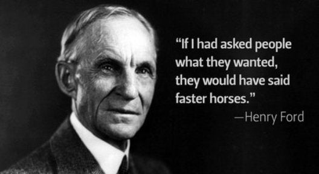
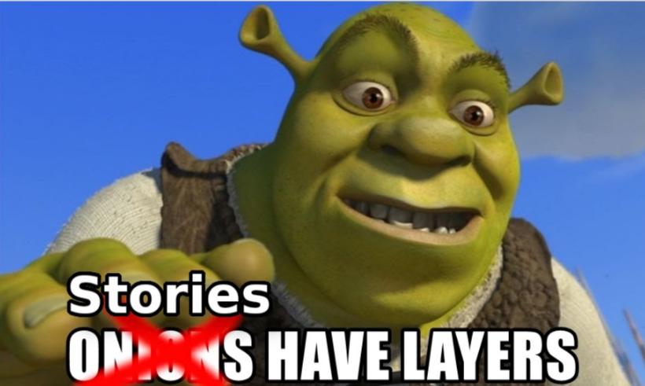
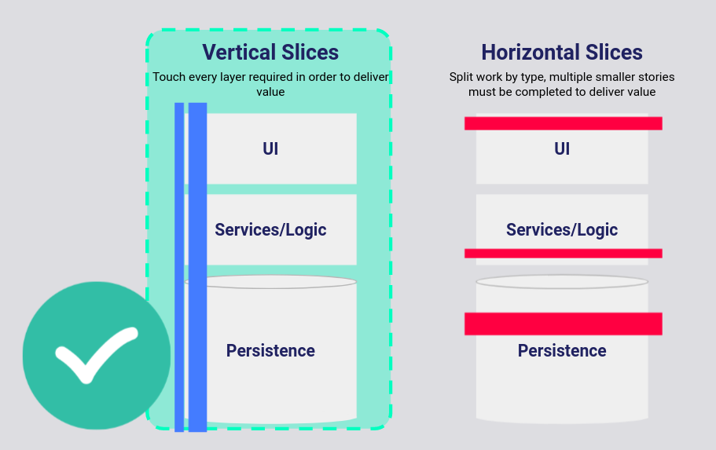
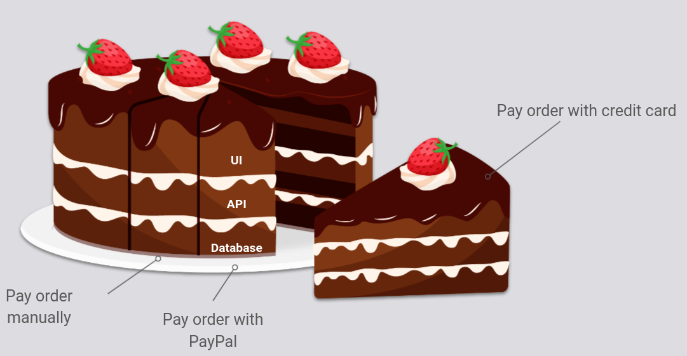
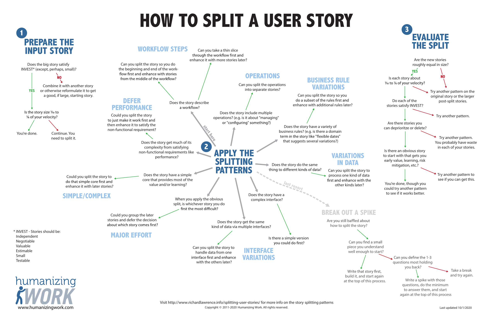
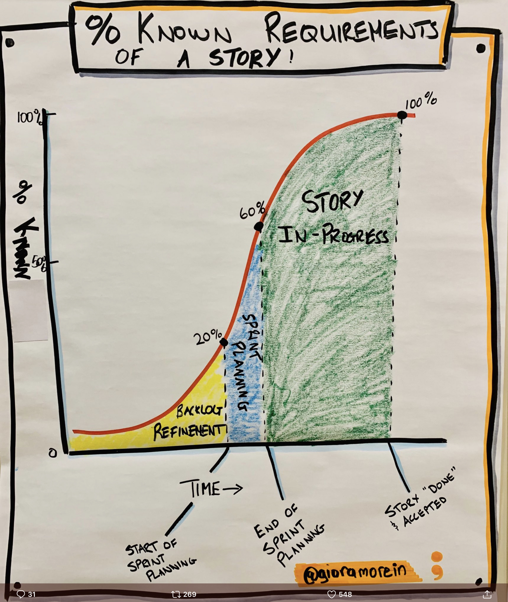

# Good User Stories

## What is a User Story

Simple, it is the story of a user. A user story is a description of a change in function to a system which is always described from the perspective of the user. 

Here is another way to phrase it: "A user story is simply a description of a change in system behavior from the perspective of a user. It describes something a user wants to do with the system or wants the system to do for them that it doesn’t do today." ([Richard Lawrence and Peter Green](https://www.humanizingwork.com/the-humanizing-work-guide-to-splitting-user-stories/))

User Stories describe customer journey and document business value. 

User stories are not a list of technical tasks which need to be accomplished in order to achieve business value, user stories describe that value from the perspective of the customer. "It’s a description of a person wanting to accomplish something in your system." ([Richard Lawrence and Peter Green](https://www.humanizingwork.com/the-humanizing-work-guide-to-splitting-user-stories/))

### The 4 questions

User stories answer 4 questions
* Who wants the thing?
* What do they want?
* Why do they want it?
* How do I know when I'm done implementing the thing?

Note that no where in the user story are there are requirements for how to implement the user story. A user story **should not describe implementation details**, just functionality.

#### Story Formats

There are a few formats that help us to answer these questions. 
* Stories cannot be properly prioritized if they are not independent

##### Narrative
Typically there will be a narrative to answer *who, what and why* then Acceptance Criteria to answer *how do I know I'm done*.

> As a... (who)
> I want... (what)
> So that... (why)

or 

> In order to... (why)
> AS a... (who)
> I want... (what)

What template is used by the team is not important. What is important is that the who what and why are answered.

**Example**

## INVEST

INVEST are a set of criteria which describe a good user story. 

### Independent
To the greatest extent, dependencies should be avoided. 

#### Example
This example is rephrased from (User Stories Applied by Cohn)[https://www.mountaingoatsoftware.com/books/user-stories-applied]

The team is building functionality to handle credit card payments to checkout a shopping cart. The team must handle Visa, Mastercard, and American Express. The team splits this into 3 user stories:
* Handle payments with Visa cards
* Handle payments with Mastercard
* Handle payments with American Express

The devs estimate the first of any of these 3 stories will be 3 story points, the following 2 will each be 1 story point. How can we handles this scenario? The business value for each is clear but it seems there is some underlying technical work which needs a home. Many teams would be tempted to create a "technical story" or "tech enabler" to solve for this, remember though, a user story always focuses on delivering business value. Instead, here are few better options:

1) Combine all 3 stories, so long as they single story still fits within 1 iteration
2) Less details when defining the story
    * "A customer can pay with one type of credit card" to be followed by "a customer can pay with the two additional credit card types"
3) The simple approach, include 2 estimates in each story. 1 estimate to be used if it is the first CC processing story and another estimate to be used if it is not

### Negotiable
User stories are not contracts. User stories are short descriptions of functionality, from the perspective of the user, the details of which should be negotiated as late as is responsible between the developers and the customer. 

Notes on the conversations had between the customer and the developers should be maintained, but these are not a contract. 

User stories can be thought of "as a reminder for the devs and customer to have a conversation."

Details can be recorded in notes and should be written out as tests(acceptance criteria). 

"You built exactly what I asked for but it's not what I wanted."

"I worked with a team that was developing software for delivering surveys. Each survey would be delivered over the phone, via email, and via interactive voice response. Different types of users would us different survey types. The surveys were very complicated: specific answers to one set of questions would determine which question would be asked next. The users needed a way to enter the surveys and they presented the development team with examples of a complicated mini-language they proposed to formulate questions. This entirely text-based approach seemed needlessly complicated to one of the developers. The developer showed the user how they could instead create surveys visually by dragging and dropping icons that represented different types of questions in a survey. The users ripped up their mini-language and worked with the developer to create a visual survey design tool. Just because the users had the problem does not mean they were uniquely qualified to propose its solution." (Cohn - User Stories Applied)[https://www.mountaingoatsoftware.com/books/user-stories-applied]

### Valuable
Each user story must be valuable. That does not mean the user story has to be valuable to the end user, but every user story does need to provide business value. For example, a specific end user may not care if the software is GDPR compliant but the business certainly does, therefore, a user story applying GDPR requirements can be a viable user story. 

Avoid user stories which are only valued by the devs. 

Examples from (Cohn - User Stories Applied)[https://www.mountaingoatsoftware.com/books/user-stories-applied]
**Bad: Dev focused**: 
* All connections to the DB are done through a connection pool 
* All error handling and logging is done through a set of common classes

**Good: User focused**:
* Up to 50 users should be able to use the application with a 5 user database license
* All errors are presented to the user and logged in a consistent manner

### Estimable
### Small
### Testable

When a story is newly written and far away from being picked up the negotiableness is more important. When a story is getting ready to be pulled into a sprint it is most important that the story is independent, valuable, and testable.

Not all INVEST criteria are made the same. In the beginning, there was independence and the devs negotiated the best solution with the customer, and it was good. Then sprint planning came, and independence, Valuable, small, and testable became most important, and the negotiableness was lessened, and it was still good.

## Vertical Slices

All the work required to deliver an increment of  value, this is what a vertical slice is. That may mean touching many layers of the application or it may mean only touching one layer, whatever is required to deliver value.

"A work item that delivers a valuable change in system behavior such that you’ll probably have to touch multiple architectural layers to implement the change. When you call the slice *done*, the system is observably more valuable to a user." ([Richard Lawrence and Peter Green](https://www.humanizingwork.com/the-humanizing-work-guide-to-splitting-user-stories/))

What we can contrast vertical slices with horizontal slices. A horizontal slice is an increment of work divided along lines of the architecture which, when finished, is not independently releasable. 

Remember the INVEST criteria. In order to make all stories valuable vertical slicing is requisite. 

The point is, the further out a story is from being started, the less details we want. As the team gets closer to picking up a story, they need to be working out the technical details and having the needed conversation with the customer and business to assure there will be no blockers when the story is picked up. In this way, the story is highly negotiable in the beginning, as the story gets closer to being started the story become less negotiable but an accurate estimate become more reasonable and the ability to deploy the story independently and delivering value becomes more possible.

### Thick slices
We all like a thick slice of cake, preferably with a glass of milk, but slim slices keep us in shape. The same is true of software development. Often it is going to be hard to find those thin vertical slices, that is where story splitting comes into play.

### Vertical slices summary
Avoid horizontal slices!

Remember, horizontal slicing is breaking up one chunk of business value down the lines of the architecture. In a 3 tier architecture, this leads to a story for the UI, a story for the API, and a story for the DB, none of which are independent, all needing to be released at once. While these "user stories" may be faster to complete, they do not get the functionality to production any quicker. 

Always include all the needed architecture changes for releasing valuable work to production in the same story.

### Example 1

As a user customer of Starbucks
I want to order a drink with 30 ingredients
So that I can make a Tick Tok to show it off

### The manyfold benefits of vertical slices
* Get value sooner
* Get earlier, higher-quality feedback
* Make value explicit in the backlog
* Have more conversations about value
* Tend not to accidentally build low-value changes
* See constraints and inventory more easily and can respond accordingly
* Become more predictable in delivering value (because working software becomes the primary measure of progress)

List originally sourced from ([Richard Lawrence and Peter Green](https://www.humanizingwork.com/the-humanizing-work-guide-to-splitting-user-stories/))

## Story Splitting

As I see it, our goals are twofold:
* Fast feedback
* Small, iterative releases of value

Story splitting is a critical tool in achieving these goals. Story splitting allows the team to get small stories, allowing us to achieve those goals. 

## When do we capture the details?

More Resources
* [The Humanizing Work Guide to Splitting User Stories](https://www.humanizingwork.com/the-humanizing-work-guide-to-splitting-user-stories/)

Job stories as an alternative to user stories
https://www.mountaingoatsoftware.com/blog/job-stories-offer-a-viable-alternative-to-user-stories